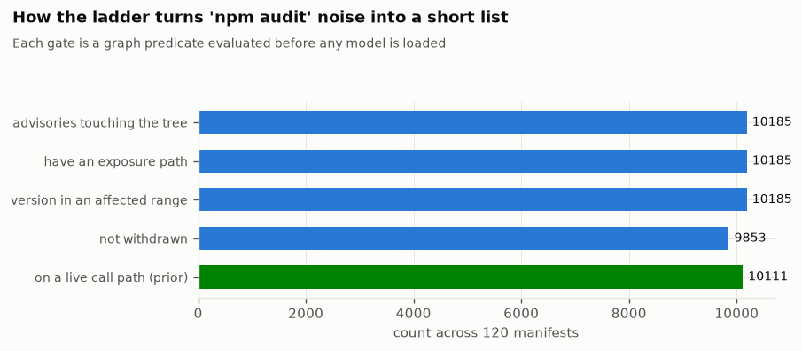
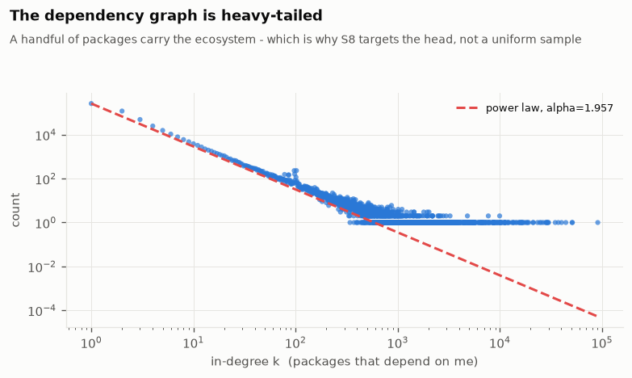
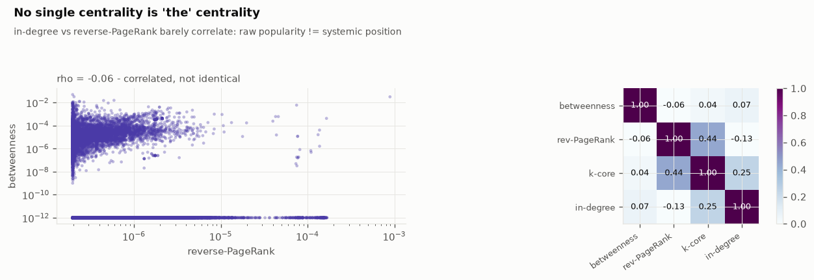
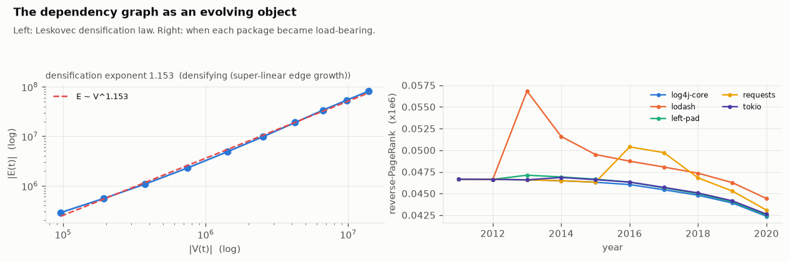
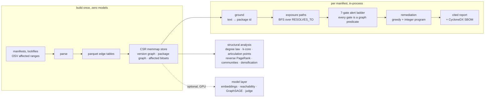

<div align="center">

# scgraph

### Graph Engineering for Software Supply-Chain Impact Analysis

**Are we exposed to this CVE, through which dependency path, and what is the safe fix?**
Answered as a path through a graph, or answered with an honest refusal. Zero language-model
calls are used to build the graph.

[](https://github.com/FareedKhan-dev/ai-graph-engineering-supplychain/actions/workflows/ci.yml)
[](https://github.com/FareedKhan-dev/ai-graph-engineering-supplychain/actions/workflows/notebook-smoke.yml)
[](LICENSE)
[](pyproject.toml)
[](results/run_manifest.json)

</div>

---

## The problem, in one scene

> You run `npm install` and get 1,200 packages. `npm audit` returns 47 findings, most of
> them unactionable. Then Log4Shell lands, and the organisation has six hours to answer,
> across 800 repositories: **are we exposed, by what path, and what is the safe fix?**

The answer is not a document. It is a **path**:

```
cat-boot-thymeleaf3@0.2.27
  └─ spring-boot-starter@2.1.7.RELEASE
       └─ spring-boot@2.1.7.RELEASE
            └─ log4j-core@2.12.1      ∈  affected(CVE-2021-44228, CVSS 10.0)
```

If there is no such path, that is a **proven property of the graph**, not a model's
opinion. The middle case, where a vulnerable package sits in the tree but the vulnerable
call cannot be shown reachable, is exactly where `npm audit` generates noise. This system
**abstains** there instead.

### Why zero language-model calls to build the graph

Every edge is a field that somebody already published: a `package.json` range, a lockfile
pin, an OSV `affected[].ranges` entry. Microsoft's GraphRAG spends on the order of
$33,000 in model calls to extract one dataset's graph. Here the graph is free to build,
so it scales to the whole ecosystem: **4,460,049 packages, 21,415,461 versions,
82,807,953 resolved dependency edges, 285,698 advisories** across eight package managers.
Language models appear only in an optional model layer (semantic relevance, a GNN, an
advisory-text severity check), and every one of them is measured against independent
ground truth, negative results included.

---

## Start here: the notebook

**[`notebooks/supply_chain_graph_engineering.ipynb`](notebooks/supply_chain_graph_engineering.ipynb)**
is the centre of this repository. It is 10 parts, 41 sections, 113 cells, committed with
every output and all 14 figures from the full run, so it reads end to end on GitHub
without running anything. Each section is **theory, then code, then an honest reading of
the result**.

| part | what it covers |
|---|---|
| I. The data thesis | native edges, zero-model construction, does deep transitive exposure actually exist |
| II. What kind of graph is this | resolution as constraint satisfaction, the CSR store, degree law and the power-law test, k-core, cycles, systemic risk, articulation points, the graph over time, communities |
| III. Grounding and traversal | free text to a package identifier, exposure-path search, the seven-gate alert ladder, the over-claim bound |
| IV. The model layer | advisory-text embeddings, real-versus-control relevance, the reachability prior |
| V. Remediation as optimisation | the minimal patch set as an integer program, the unfixable fraction, the cited report and SBOM, remediation as a graph edit |
| VI. System intelligence | a capability graph of specialists, coordinated versus one-pass, the versioned run graph, dependency-graph bisect |
| VII. Representation learning | temporal, leakage-free CVE-risk node classification with GraphSAGE versus a tabular baseline |
| VIII. Honest evaluation | the instrument check, the comparison against `osv-scanner`, the scorecard, the bugs that produced reassuring wrong answers |
| IX. Visual analysis | the 14 figures, one question each |
| X. Performance | build, load, and query latency, throughput, the scaling curve |

Run it yourself on a laptop in a few minutes:

```bash
git clone https://github.com/FareedKhan-dev/ai-graph-engineering-supplychain.git && cd ai-graph-engineering-supplychain
python -m venv .venv && . .venv/bin/activate        # Windows: .venv\Scripts\activate
pip install -e ".[notebook]"
python -m ipykernel install --user --name scgraph
python scripts/acquire_smoke.py                      # ~3 min, live OSV + deps.dev, no large download
jupyter lab notebooks/supply_chain_graph_engineering.ipynb
```

The setup cell has `SMOKE_TEST = True` for the laptop-scale run and `SMOKE_TEST = False`
for the full corpus. See [`notebooks/README.md`](notebooks/README.md).

---

## What you get

### The alert funnel: from `npm audit`'s wall of findings to a short list

<div align="center"></div>

Every stage is a graph predicate checked before any model is consulted: is the advisory
real and not withdrawn, is a vulnerable version actually in the resolved tree, is there a
path, was the advisory knowable at ship time, is the severity above the floor. What
survives carries its path. What does not survive is reported as suppressed, with the
reason, so nothing is hidden.

### The dependency graph is heavy-tailed, but it is not scale-free

<div align="center"></div>

In-degree follows `alpha = 1.957`, and a small number of packages carry the ecosystem
(maximum in-degree 90,850; 87.7 percent of packages have nothing depending on them). But
the Clauset bootstrapped goodness-of-fit test returns **p = 0.0**: a pure power law is
rejected, a lognormal or a power law with a cutoff fits better. Calling the graph
"scale-free" without running that test would be an over-claim, and the dependency-graph
literature routinely makes it.

### Popularity is not systemic position

<div align="center"></div>

Spearman correlation between raw in-degree and reverse PageRank on the connected core is
**-0.13**. The packages whose compromise would reach the most of the ecosystem are not
the packages with the most direct dependents. There is no single "most central" node;
the four centralities disagree, and that disagreement is the finding.

### The ecosystem densifies as it grows

<div align="center"></div>

Edges grow as `|E| ~ |V|^1.153` (R-squared 0.998): a clean confirmation of the
Leskovec-Kleinberg-Faloutsos densification law. Each new package depends on more existing
packages than the last one did. The attachment kernel is super-linear at the head: a
package that just became popular gets adopted even faster.

### It is fast

<div align="center"></div>

A full manifest audit runs in-process in **0.02 ms at the median, 2,546 audits per
second**, on the 82.8M-edge graph. Building the CSR store from parquet takes 2.3 minutes;
loading it takes 13 seconds. A Neo4j network round-trip alone is 1 to 5 ms; this does the
whole audit in less.

---

## Headline results

All reproduced in [`results/run_manifest.json`](results/run_manifest.json) and
[`results/scorecard.json`](results/scorecard.json).

| dimension | result | how it is checked |
|---|---|---|
| graph scale | 4,460,049 packages, 21,415,461 versions, 82,807,953 resolved edges | Libraries.io + OSV, parsed deterministically |
| version resolution | **97.2%** in-snapshot agreement with deps.dev's resolver (npm 97.6%, cargo 100%) | live deps.dev API |
| exposure detection | **96.9%** agreement with `osv-scanner` over 150 generated lockfiles | side-by-side confusion matrix |
| degree distribution | alpha 1.957, Clauset goodness-of-fit **p = 0.0**, power law rejected | `scgraph.graphshape.powerlaw_gof` |
| structural criticality | 88,273 articulation points, 386,554 bridges; Spearman(in-degree, reverse-PageRank) = -0.13 | Hopcroft-Tarjan, Brandes, power iteration |
| systemic risk concentration | reverse-PageRank Gini (core) = 0.262 | reverse PageRank on the package graph |
| ecosystem evolution | densification exponent 1.153, community modularity Q 0.518 | Leskovec law, label propagation |
| remediation | **2,105 of 2,177** exposed manifests contain a package with no safe fix; graph-aware fixes still introduce 317 new advisories and leave 28 manifests net worse | integer program (SciPy HiGHS) + differential analysis |
| feature ablation | advanced graph signals reorder half the top-20 alert queue and flip the top escalation target 67.5% of the time, but do **not** improve a binary risk classifier | `scripts/run_evaluation.py` |
| semantic relevance | AUROC 0.955 real advisory text versus control (partly lexical, stated) | BGE-small embeddings |
| representation learning | temporal, leakage-free GraphSAGE AUROC 0.80; bootstrap AP delta over the same features tabular +0.013, CI [0.005, 0.021] | `scgraph.gnn` |
| advisory-text severity check | Qwen3-14B oracle 0.875 versus 0.53 blind baseline | `scgraph.judge` |
| full-audit latency | p50 0.02 ms, p99 6.8 ms, 2,546 audits per second, single process | `scripts/run_evaluation.py` on the full graph |

Three of these numbers are partly tautological or lexical and are labelled as such in
[`docs/evaluation.md`](docs/evaluation.md) and notebook section S28. That honesty is
deliberate.

---

## How it works



The engine is 25 modules in [`src/scgraph/`](src/scgraph/), in seven layers:

| layer | modules | what it produces |
|---|---|---|
| Data | `acquire`, `acquire_full`, `parse`, `osv` | native edges from published fields, no model |
| Graph store | `kgstore` | the CSR memmap graph and the affected-version bitsets |
| Structure | `graphshape`, `centrality`, `systemic`, `community`, `temporal` | degree law, k-core, cycles, articulation points, reverse PageRank, densification, communities |
| Grounding | `ground`, `paths`, `ladder` | free text to a PURL, exposure-path search, the seven-gate ladder |
| Remediation | `remediate`, `report`, `whatif` | the minimal patch set, the cited report, the SBOM, remediation as a graph edit |
| Model layer (optional, GPU) | `embed`, `reach`, `gnn`, `judge` | semantic relevance, a reachability prior, node classification, a severity check |
| System | `agents`, `runstate` | a capability graph, a coordinated run, a versioned run graph, dependency-graph bisect |

The seven-gate alert ladder, in order: **(1)** the question grounded to a package in the
graph, **(2)** a resolved dependency path reaches it, **(3)** a terminal version sits in
an affected range, **(4)** that version is installable and not yanked, **(5)** a
supporting advisory is not withdrawn, **(6)** the advisory was published on or before the
shipped version, **(7)** the vulnerable code is on a live call path, or reachability is
explicitly deferred to manual review. Gates 1 to 6 are pure graph predicates. An alert
that clears all seven carries its path. Anything else is suppressed with a stated reason.

Full detail in [`docs/architecture.md`](docs/architecture.md) and
[`docs/methodology.md`](docs/methodology.md).

---

## Repository layout

```
src/scgraph/          the engine: 25 modules across the seven layers above
notebooks/            the notebook, committed with its full-run outputs and 14 figures
scripts/              argparse CLIs: acquire, build graph, run pipeline, run evaluation, fetch artifacts
tests/                93 tests: unit tests plus a smoke-pipeline integration test
results/              committed evidence: 15 figures, 25 metric files, 11 exposure reports, 11 SBOMs
docs/                 architecture, methodology (with citations), data sources, results, evaluation, glossary
data/                 not committed; scripts regenerate or fetch it (see data/README.md)
```

---

## Reproducing

| tier | what you get | time | disk | GPU |
|---|---|---|---|---|
| read-only | every figure, metric, report, and the notebook with its outputs | none | this repo | no |
| smoke | the whole pipeline on a real but small corpus, on a laptop | ~3 min | < 1 GB | no |
| full, from artifacts | the full-scale CPU pipeline | ~10 min | ~3 GB | for the model layer |
| full, from source | the parsed corpus rebuilt from the 24.89 GB Zenodo dump | hours | ~130 GB | for the model layer |

```bash
# smoke
python scripts/acquire_smoke.py && python scripts/run_pipeline.py --profile smoke

# full, from the published artifacts (skips the 25 GB download)
python scripts/fetch_artifacts.py --set full
python scripts/build_graph.py                       # rebuild the 2 GB CSR store, ~2.3 min
python scripts/run_pipeline.py --profile full
```

`make help` lists every task. Full instructions, including the full run on a GPU box, are
in [`docs/reproducing.md`](docs/reproducing.md).

---

## Data sources

| source | use | license |
|---|---|---|
| [Libraries.io Open Data](https://libraries.io/data) v1.6.0 (Zenodo 3626071) | package, version, and dependency edges | CC BY-SA 4.0 |
| [OSV](https://osv.dev) `all.zip` | advisories with machine-readable affected ranges | CC BY 4.0 |
| [GitHub Advisory Database](https://github.com/github/advisory-database) | GHSA records, CVE aliases, CWE | CC BY 4.0 |
| [deps.dev](https://deps.dev) API | resolver ground truth, evaluation only | per deps.dev terms |
| CVSS v3.1 / v4.0 specifications | severity arithmetic, no model | FIRST.org |

The corpus is a 2020-01-12 snapshot, which is why the resolver comparison is reported
"in-snapshot". Details and provenance in [`docs/data-sources.md`](docs/data-sources.md).

---

## Documentation

| page | what it covers |
|---|---|
| [architecture.md](docs/architecture.md) | the pipeline, the CSR store, the alert ladder, a data-flow diagram |
| [methodology.md](docs/methodology.md) | every graph and statistical method, with its literature reference and result |
| [data-sources.md](docs/data-sources.md) | the corpus, exact versions, licenses, how it is parsed |
| [results.md](docs/results.md) | the full-run findings, read in context |
| [evaluation.md](docs/evaluation.md) | the five evaluation modules and the honest caveats |
| [reproducing.md](docs/reproducing.md) | smoke locally, full on a GPU box |
| [glossary.md](docs/glossary.md) | articulation point, CSR, CVSS, k-core, PURL, SBOM, VEX, and the rest |

---

## Honest limitations

- **The "100% path retention" figure is a tautology.** The real parse retention is
  96.64 percent, and the resolver-logic agreement is 97.2 percent; all three are given
  and distinguished in [`docs/evaluation.md`](docs/evaluation.md).
- **The ablation-monotonicity check is a consistency test, not a causal proof.**
- **The semantic-relevance AUROC is partly lexical overlap** between the advisory text
  and the package name.
- **The model layer needs a CUDA GPU.** The full parquet corpus and the embeddings are
  distributed as GitHub Release assets, not committed.
- **"Zero false negatives" is not claimed.** It is unfalsifiable.

---

## Citation and license

If you use this work, cite it via [`CITATION.cff`](CITATION.cff). It is modelled on the
survey *Graph Engineering in the Era of LLM Agents* (arXiv:2608.21156v2).

Licensed under [Apache-2.0](LICENSE). The bundled advisory and dependency data keep their
upstream licenses.
