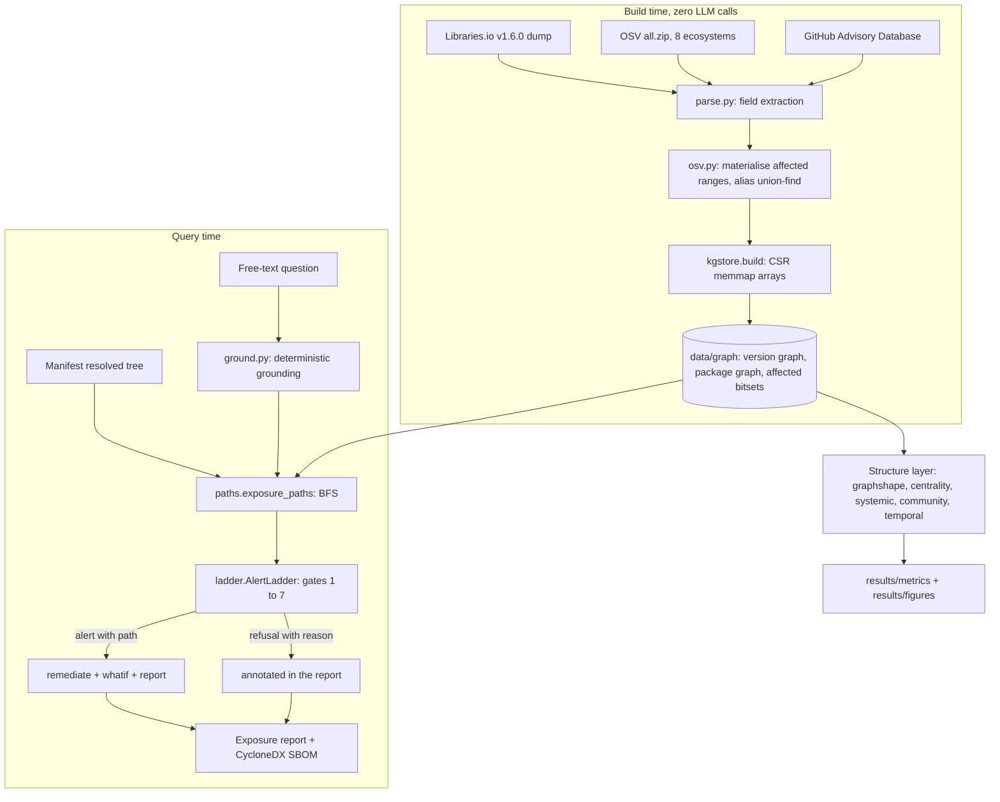

# Architecture

This page describes the `scgraph` pipeline end to end: the seven layers, the modules that
implement each one, the compressed-sparse-row graph store, version resolution, the
seven-gate alert ladder, exposure-path traversal, remediation as constrained
optimisation, and the system-intelligence layer. It closes with a data-flow diagram.

The engine is 25 Python modules under [`src/scgraph/`](../src/scgraph). Importing the
package pulls only NumPy, PyArrow, SciPy, scikit-learn and the standard library; the
model layer (`embed`, `reach`, `gnn`, `judge`) imports PyTorch and Transformers lazily
and is optional.

---

## 1. The layered design

The pipeline is organised as seven layers. Data flows downward at build time (published
fields become graph edges) and a query flows through the upper layers at run time (a
question becomes a set of proven exposure paths, or a refusal).

```
  Data          acquire, acquire_full, parse, osv        native edges, zero models
  Graph store   kgstore                                  CSR memmap graph + affected bitsets
  Structure     graphshape, centrality, systemic,        degree law, k-core, cycles,
                community, temporal                       articulation points, PageRank,
                                                          densification, communities
  Grounding     ground, paths, ladder                    text to PURL, exposure BFS,
                                                          the seven-gate alert ladder
  Remediation   remediate, report, whatif                ILP patch set, cited report,
                                                          CycloneDX SBOM, graph-edit diff
  Model layer   embed, reach, gnn, judge                  semantic relevance, reachability
  (GPU, opt.)                                             prior, node classification, judge
  System        agents, runstate                         capability graph, coordinated run,
                                                          versioned run graph, bisect
```

Supporting modules used across layers: `versions` (per-ecosystem version comparison and
OSV affected-range evaluation), `cvss` (CVSS v3.x and v4.0 vector to base score),
`resolve` (declared-range to concrete-version resolution for the full corpus).

### 1.1 Data layer

**Modules:** [`acquire.py`](../src/scgraph/acquire.py),
[`acquire_full.py`](../src/scgraph/acquire_full.py),
[`parse.py`](../src/scgraph/parse.py), [`osv.py`](../src/scgraph/osv.py).

**Produces:** the columnar edge tables, as Parquet, under `data/parquet/`:

| table | columns | meaning |
|---|---|---|
| `packages` | `pkg_id, ecosystem, name` | node table |
| `versions` | `ver_id, pkg_id, version, is_default, published` | node table |
| `resolved` | `ver_id, res_ver_id` | Version to Version `RESOLVES_TO` edges (the traversable graph) |
| `advisories` | `adv_id, osv_id, canon_id, summary, severity, withdrawn, published` | one row per OSV record |
| `affected` | `adv_id, pkg_id, entry_json` | one row per raw OSV `affected[]` entry |
| `affected_versions` | `adv_id, ver_id` | materialised: which concrete versions fall in an affected range |
| `aliases` | `osv_id, alias` | Advisory to Advisory alias pairs (CVE to GHSA to RUSTSEC to PYSEC) |

`acquire.py` wires the smoke regime: the complete OSV advisory feed for five ecosystems
plus a small resolved dependency graph fetched from the deps.dev API.
`acquire_full.py` wires the full regime: the Libraries.io Open Data dump (Zenodo record
3626071) plus the OSV feed for eight ecosystems plus a shallow clone of the GitHub
Advisory Database for CWE identifiers and CVE aliases. `parse.py` turns raw acquisitions
into the edge tables by field extraction with `json` and `csv`; no model is involved and
not one edge is inferred. `osv.py` materialises `affected_versions` (for every
advisory-package pair, which concrete versions in the snapshot fall inside the affected
range), builds the alias union-find that maps every advisory id to a canonical CVE, and
builds the `withdrawn` mask.

### 1.2 Graph-store layer

**Module:** [`kgstore.py`](../src/scgraph/kgstore.py).

**Produces:** the compressed-sparse-row (CSR) memmap store under `data/graph/`: a set of
`.npy` arrays that are memory-mapped read-only. See section 3 below.

### 1.3 Structure layer

**Modules:** [`graphshape.py`](../src/scgraph/graphshape.py),
[`centrality.py`](../src/scgraph/centrality.py),
[`systemic.py`](../src/scgraph/systemic.py),
[`community.py`](../src/scgraph/community.py),
[`temporal.py`](../src/scgraph/temporal.py).

**Produces:** the network-science measurements written to `results/metrics/`
(`graph_shape.json`, `criticality.json`, `systemic.json`, `community.json`,
`graph_growth.json`, `temporal.json`) and the figures they drive.

Every function operates on a CSR pair `(indptr, indices)` so the same code runs on the
smoke sample and on the full 4.46M-package graph. `graphshape` computes the degree
distribution and its power-law fit, k-core decomposition, connected components, DAG
depth and sampled distances. `centrality` computes articulation points, bridges and
sampled betweenness. `systemic` computes reverse PageRank, blast radius and the
single-maintainer-compromise counterfactual. `community` computes label propagation and
Newman-Girvan modularity. `temporal` reconstructs the graph as it stood at past instants
and fits the densification law, the preferential-attachment kernel and PageRank
trajectories. The methods and their results are described in
[methodology.md](methodology.md).

### 1.4 Grounding layer

**Modules:** [`ground.py`](../src/scgraph/ground.py),
[`paths.py`](../src/scgraph/paths.py), [`ladder.py`](../src/scgraph/ladder.py).

**Produces:** for a manifest and a question, a set of provenanced exposure paths and a
per-advisory verdict (alert, or a named refusal reason).

`ground` turns free text into graph entry points deterministically (section 4).
`paths` runs the breadth-first search that produces the exposure paths (section 6).
`ladder` applies the seven gates that decide whether a path becomes an alert (section 5).

### 1.5 Remediation layer

**Modules:** [`remediate.py`](../src/scgraph/remediate.py),
[`report.py`](../src/scgraph/report.py), [`whatif.py`](../src/scgraph/whatif.py).

**Produces:** a minimal set of version bumps (or a determination that the tree is
unfixable), a Markdown exposure report where every finding carries its path, a CycloneDX
SBOM with per-component exposure annotations, and a before-and-after graph diff for each
proposed fix. Committed examples are in [`../results/reports/`](../results/reports) and
[`../results/sbom/`](../results/sbom).

### 1.6 Model layer (GPU, optional)

**Modules:** [`embed.py`](../src/scgraph/embed.py),
[`reach.py`](../src/scgraph/reach.py), [`gnn.py`](../src/scgraph/gnn.py),
[`judge.py`](../src/scgraph/judge.py).

**Produces:** a semantic-relevance signal (does the advisory text describe how the
package is used), a call-graph reachability verdict, a temporal node-classification
model, and an advisory-text severity-band check used only as a measurement instrument.
Every one of these is measured against independent ground truth, negative results
included ([evaluation.md](evaluation.md)). None of them is in the alerting path: an alert
is produced by the deterministic layers above and the model layer only annotates or
suppresses.

### 1.7 System layer

**Modules:** [`agents.py`](../src/scgraph/agents.py),
[`runstate.py`](../src/scgraph/runstate.py).

**Produces:** a capability graph that routes each subtask to an ecosystem-specific
handler, a coordinated multi-agent run that can be compared against the one-pass
pipeline, and a versioned run graph that supports dependency-graph bisect and recovery
(section 8).

---

## 2. Zero-LLM graph construction

Every edge in the graph is a field that someone already published:

| edge | source field |
|---|---|
| `Version --RESOLVES_TO--> Version` | a lockfile pin, or the resolver run over a manifest range |
| `Advisory --AFFECTS--> Package` and `--AFFECTS_VERSION--> Version` | OSV `affected[].ranges[].events` and `affected[].versions` |
| `Advisory --ALIAS_OF--> Advisory` | OSV `aliases` |
| `Advisory --WITHDRAWN` | OSV `withdrawn` |
| `Version --HAS_DEFAULT` | registry "latest" pointer |
| `Version --PUBLISHED_AT` | registry publish timestamp |

Because no language model is called to extract the graph, construction scales to the
whole ecosystem. The full run built a graph of **4,460,049 packages, 21,415,461
versions, 82,807,953 resolved edges and 285,698 advisories with 0 LLM calls**
([`run_manifest.json`](../results/run_manifest.json), field
`llm_calls_to_build_graph`).

For contrast, Microsoft's GraphRAG extracts a graph from a text corpus by prompting a
language model on every chunk; the reported cost is on the order of 33,000 US dollars in
model calls for a single dataset. That cost model does not scale to millions of packages,
and it is unnecessary here because the dependency and advisory data are already
structured. Language models appear only in the optional model layer, and only for
signals that are genuinely about natural-language text (a package description, an
advisory summary, a CVSS vector).

---

## 3. The CSR memmap graph store (`kgstore.py`)

### 3.1 Why not a graph database

A graph database such as Neo4j has no bulk edge loader: relationships are inserted one
statement at a time. At roughly 10^8 to 10^9 edges and one to five milliseconds per
statement, loading alone is days of round-trips before a single query runs, and a
server process still cannot answer a k-hop neighbourhood expansion in the microseconds
that a tight audit loop needs. Knowing when not to reach for a database is part of the
engineering.

### 3.2 What compressed sparse row is

Sort every edge by its source node. Then `indptr[i]` is the offset into `indices` where
node `i`'s neighbour list begins, and `indices[indptr[i]:indptr[i+1]]` is exactly node
`i`'s neighbours. A neighbour lookup is one array slice: `O(degree)`, no allocation, no
inter-process communication, no query parser. Amortised build cost is `O(E log E)`, the
cost of the sort. Storage is `4 * (V + E)` bytes with `int32` indices.

The build (`kgstore.build`) writes these arrays as `.npy` files. `KGStore.__init__` opens
them with `mmap_mode="r"`, so a process starts by mapping the arrays into its address
space rather than reading them, and the operating system page cache decides what stays
resident.

### 3.3 The three stores

| store | arrays | direction | used for |
|---|---|---|---|
| version graph | `res_indptr / res_indices` and `rdep_indptr / rdep_indices` | forward (`RESOLVES_TO`) and reverse (dependents) | exposure-path BFS, blast radius |
| package graph | `pkgdep_indptr / pkgdep_indices` and `pkgrev_indptr / pkgrev_indices` | forward and reverse, package to package | k-core, centrality, systemic risk, communities, densification |
| affected bitsets | `aff_adv_indptr / aff_adv_ids` | version to advisory | "is this version affected", `O(1)` per version |

The package graph is derived from the version graph: package A depends on package B if
any version of A resolves to any version of B, deduplicated. The full run has 6,682,795
package-level edges collapsed from the 82,807,953 version-level resolved edges. Both
directions of every store are materialised, so "what breaks if I bump X" is a single
reverse slice.

The store also carries per-version arrays (`ver_pkg`, `ver_str`, `ver_default`,
`ver_published`), per-package arrays (`pkg_eco`, `pkg_name`), per-advisory arrays
(`adv_sev`, `adv_withdrawn`, `adv_published`, `adv_summary`, `adv_canon`), the alias map,
and the `canon_to_idx` and `(ecosystem, name)` lookup indices built at load time.

### 3.4 Measured cost

From [`results/metrics/timing.json`](../results/metrics/timing.json), on the full graph:

- Build from Parquet: `osv.materialise` 27.9 s, then `kgstore.build` 140.3 s (about 2.3
  minutes for the CSR store itself).
- Load per process: `KGStore.__init__` 13.19 s, peak resident set 16,047 MB.
- Node-expansion probe: neighbour, dependent and advisory lookups over a random sample of
  versions, at a rate consistent with a **p50 full-audit latency of 0.02 ms** and a
  single-process **throughput of 2,546 audits per second**. A Neo4j network round-trip
  alone is one to five milliseconds.

---

## 4. Version resolution as constraint satisfaction (`resolve.py`)

The traversable graph is built from concrete versions, but a manifest declares *ranges*
(`^1.2.0`, `>=1.0,<2.0`, `[1.0,2.0)`). Choosing one concrete version per package so that
every range constraint is satisfied is, in the general case with peer dependencies and
diamond conflicts, NP-complete: it encodes Boolean satisfiability, with each
package-version a variable and each range a clause. This is why lockfiles exist:
resolution is solved once and frozen.

`resolve.py` implements the common subset that covers roughly 99 percent of real
manifests:

| ecosystem | grammar |
|---|---|
| npm, Cargo, Packagist | node-semver: `^ ~ >= <= > < =`, `,` and `\|\|`, `x` and `*` wildcards, `a - b` hyphen ranges |
| PyPI | PEP 440, via `packaging.specifiers` (no reimplementation) |
| Maven | interval notation `[a,b)`, `(,b]`, `[a,]`, plus a soft `a` |
| Go | exact (`go.mod` requirements are already concrete), or semver `>=` |

The policy is to pick the highest published version that satisfies the range, preferring
non-prerelease, which matches npm and Cargo default install behaviour and deps.dev's
resolver closely enough for a bulk graph. Where the Libraries.io row already carries a
`resolved_version`, that is used like a lockfile pin. Where nothing satisfies, the edge
is a dangling stub and is counted, not silently dropped.

Resolver logic is validated against deps.dev in [evaluation.md](evaluation.md): when
deps.dev's chosen version also exists in the January 2020 snapshot, the two resolvers
agree **97.2 percent** of the time.

---

## 5. The seven-gate alert ladder (`ladder.py`)

The ladder turns "npm audit says 47 things" into a short list whose every entry carries a
path, plus an explicit refusal for everything else. **Gates 1 through 6 are pure graph
predicates evaluated before any model is invoked.** A refusal is not a model choosing to
be cautious; it is an empty result set from a deterministic query.

| gate | condition that suppresses the alert | why it exists |
|---|---|---|
| 1 | nothing in the question grounded to a package or advisory we index | the question named nothing in the graph |
| 2 | grounded, but no resolved dependency path reaches an affected version | present in name only, unconnected in the resolved tree |
| 3 | no path terminal is in an affected range | present, but at a safe version (subsumed by gate 2's path construction) |
| 4 | affected only via a version that is yanked or unpublished | the evidence is a non-installable version |
| 5 | every remaining path runs through a **withdrawn** advisory | the alarm was retracted upstream |
| 6 | as-of-date: no supporting advisory was published on or before the date the shipped version was released | the advisory was not knowable then |
| 7 | present, but the vulnerable symbol is not on a live call path | annotate for review, do not alert |

Gate 7 is the only gate that can consult the model layer (a static call-graph verdict, or
the structural reachability prior). It is optional and off by default unless a
reachability map is supplied. Between gates 6 and 7 there is also a severity floor
(`min_severity`, default 0.0).

`AlertLadder.evaluate(groundings, paths, reachability=None)` returns a `Verdict` with a
boolean `alert`, a `reason` string (`not_grounded`, `no_exposure_path`,
`only_noninstallable_evidence`, `only_withdrawn_advisories`, `not_knowable_as_of_date`,
`below_severity_floor`, `present_but_unreachable`, or `exposed`), and the surviving paths
sorted by descending severity then ascending depth. `audit_manifest` applies the ladder
to every advisory that touches a manifest's resolved tree and returns the full
classified report.

The causal behaviour of the ladder is tested by ablation: when the affected terminals are
deleted from the graph in escalating tiers, the alert count must fall monotonically to
zero. The full run gives **4,084 to 3,691 to 3,545 to 0**, monotonic
([`exp_ablation.json`](../results/metrics/exp_ablation.json)).


---

## 6. Exposure paths (`paths.py`)

The naive question is "does my manifest list a vulnerable package". The right question is
"is there a path in the resolved tree from my application to an affected version", and the
evidence *is* that path. `exposure_paths(store, root_vid, max_depth, max_paths)` runs a
breadth-first search from the manifest root over the forward `RESOLVES_TO` store. Every
time a visited version is affected by an advisory, it emits an `ExposurePath` carrying:
the canonical advisory id, the OSV id, the CVSS base score, the `withdrawn` flag, the
list of hop version ids from root to terminal, the depth, the terminal package string,
and the advisory publish date.

Two provenanced classes:

- **DIRECT**: the affected version is at depth 1, a direct dependency of the root.
- **TRANSITIVE**: the affected version sits deeper; the path names every hop, and each hop
  is a `RESOLVES_TO` edge that a resolver produced.

Paths are deduplicated by `(advisory, terminal)` and ranked shallow-first then by
descending severity, because a shallow high-severity path is what an on-call engineer acts
on first. The reverse direction (`blast_radius`) walks the reverse store to answer "if we
must yank or patch X, whose build breaks", bounded by a hop limit and a node budget
because a hub such as `lodash` has millions of transitive dependents and the exact count
past a few hundred thousand is not actionable.

A committed worked example ([`results/reports/report_00.md`](../results/reports/report_00.md))
traces a Spring Boot 2.1.7 project to Log4Shell:

```
[CVE-2021-44228  cvss=10.0] cc.catalysts.boot:cat-boot-thymeleaf3@0.2.27
  -> org.springframework.boot:spring-boot-starter@2.1.7.RELEASE
  -> org.springframework.boot:spring-boot@2.1.7.RELEASE
  -> org.apache.logging.log4j:log4j-core@2.12.1
```

---

## 7. Remediation as optimisation (`remediate.py`)

Given a manifest's exposure paths, find the smallest set of version bumps that clears
every advisory without entering a new affected range or crossing a major-version
boundary. This is weighted set cover, which is NP-hard, so two solvers are reported.

**`greedy_fix`** picks, per affected package, the lowest clean non-prerelease version at
or above the current one. It always terminates, scales, and gives an upper bound on the
bump count. This is what most tools do.

**`ilp_fix`** is the honest formulation. Binary variables `y[p,v]` choose version `v` of
package `p`; one-hot constraints force exactly one version per package; a hard linear
constraint requires the chosen version to be advisory-free; the objective is
`number of bumps + lambda * number of major bumps`. It is solved with
`scipy.optimize.milp` (the HiGHS branch-and-bound solver). The ILP exposes what greedy
hides: sometimes fixing A forces a downgrade of B and no assignment satisfies
everything, so the tree is **unfixable** without a major bump or a pinned exception.

Prerelease filtering matters: `_clean_versions` excludes alpha, beta, rc, dev and
SNAPSHOT versions unless the version being replaced is itself a prerelease. Without this
filter the greedy fixer recommends versions such as `jetty 10.0.0-alpha0`, which inflates
both the "needs a major bump" and "advisories introduced" counts (this was a real bug,
see [evaluation.md](evaluation.md)).

Full-run result ([`exp_remediation.json`](../results/metrics/exp_remediation.json)): of
**2,177 exposed manifests, 641 have a remediation, 2,105 contain a package with no safe
fix, and 367 need a major bump.**

### 7.1 A remediation is a graph edit (`whatif.py`)

A proposed bump is an edit to the graph: every `RESOLVES_TO` edge that pointed at a
version of the bumped package is repointed. You evaluate the edit by re-running the
queries on both sides. `diff_manifest` applies the bump set as an in-memory overlay (a
dict of redirected edge targets consulted during the walk, so a what-if costs
`O(affected subtree)` rather than a graph rebuild) and reports advisories cleared,
advisories **introduced** (the new version is itself in some other advisory's range),
the change in tree depth, and the change in total CVSS mass. `fix_ripple` counts how many
other manifest roots contain the bumped package, the blast radius of landing the fix in a
shared lockfile.

Full-run result ([`whatif_portfolio.json`](../results/metrics/whatif_portfolio.json)):
across the 641 fixable manifests the greedy fixes clear 2,334 advisories but
**introduce 317**, move total CVSS mass from 139,316.6 to 128,519.5, and leave **28
manifests net worse**.


---

## 8. The system-intelligence layer (`agents.py`, `runstate.py`)

The one-pass pipeline is `ground -> traverse -> gate -> remediate`, and a refusal is
final. The system layer adds the survey's three graph views so that "does coordination
help" can be measured rather than assumed.

**Capability graph (`agents.CapabilityGraph`).** Typed edges from each agent to the
ecosystems it handles, the tools it holds, and its measured reliability per task class.
Routing a Go module to `Resolver.go` is a graph query (`route(task, ecosystem)` returns
the highest-reliability agent that serves that pair). The agents include ecosystem-scoped
resolvers, an advisory matcher, ecosystem-scoped reachability analysts, a license
auditor, a patch proposer, a build verifier, an escalator and a reporter.

**Coordinated vs one-pass (`run_one_pass`, `run_coordinated`).** The coordinated run adds
a reachability analyst that gates the patch proposer (patch only what is on a live path),
a build verifier that can bounce a breaking major bump back for refinement, and an
escalator for the unfixable. `PatchProposer` and `BuildVerifier` are **separate nodes on
purpose**: the confirmation-bias failure mode, where the agent that writes the patch also
grades it, is designed out rather than prompted away. Every hand-off is an edge in a
`CommGraph`, and the "only 3 of 11 advisories are on a live path" message is marked
decisive.

Full-run result ([`exp_coordination.json`](../results/metrics/exp_coordination.json)):
one-pass produces 12,717 alerts and clears 273 advisories; coordinated produces 12,316
alerts and clears 178. Coordination trades coverage for a marginal precision gain with no
clear win, so the agent loop is kept as a measured ablation rather than presented as the
architecture.


**Versioned run graph (`runstate.RunGraph`).** An append-only event log plus a
per-(manifest, package) status with provenance. A proposed bump is a tentative write;
`BuildVerifier` commits it. This is an explicit proposal-then-validate-then-commit
boundary.

**Dependency-graph bisect (`runstate.bisect_build`).** When a build goes red after
bumping `{A, B, C, D}` together, which single bump is decisive? Leave-one-out over the
bump set, re-checking a build predicate, finds the culprit in `O(n)` build runs; if no
single removal fixes it, the routine delta-debugs down to a minimal interacting subset.
This is git-bisect moved from the file diff to the dependency-graph diff, possible only
because the run graph kept both the pre-bump and post-bump resolution.

**Recovery (`runstate.recover`).** Given the decisive bump: try the next clean
non-major version, pin with a recorded exception, or escalate. Each step records a
recovery boundary so the run stays re-runnable.

---

## 9. Data-flow diagram

### Build time

```
  Libraries.io v1.6.0 dump          OSV all.zip (8 ecosystems)     GitHub Advisory DB
  (Zenodo 3626071, 24.89 GB)        (live each run)                (CWE, CVE aliases)
          |                                 |                              |
          v                                 v                              v
  +-------------------------------------------------------------------------------+
  |  acquire_full.py  /  acquire.py     (download, verify md5, keep zips as zips) |
  +-------------------------------------------------------------------------------+
          |
          v
  +-------------------------------------------------------------------------------+
  |  parse.py     field extraction, no model                                     |
  |               -> packages, versions, resolved, advisories, affected, aliases |
  +-------------------------------------------------------------------------------+
          |
          v
  +-------------------------------------------------------------------------------+
  |  osv.py       materialise affected ranges -> affected_versions bitsets        |
  |               alias union-find -> canonical CVE ; withdrawn mask              |
  +-------------------------------------------------------------------------------+
          |
          v
  +-------------------------------------------------------------------------------+
  |  kgstore.build   sort edges by source -> CSR .npy arrays (memmap)            |
  |     version graph (fwd + rev) | package graph (fwd + rev) | affected bitsets |
  +-------------------------------------------------------------------------------+
          |
          v
     data/graph/*.npy    (about 2 GB, rebuilds in ~2.3 min)
```

### Query time

```
  "are we exposed to the log4j thing?"        a manifest (resolved tree root)
                 |                                        |
                 v                                        |
        +-----------------+                               |
        |  ground.py      |  purl -> advisory id -> incident alias -> exact name
        |  (no model)     |  -> normalised name ; index only real packages
        +-----------------+                               |
                 |  package / advisory entry points       |
                 v                                        v
        +-----------------------------------------------------------+
        |  paths.exposure_paths   BFS the resolved tree             |
        |  emit ExposurePath per (advisory, affected terminal)      |
        +-----------------------------------------------------------+
                 |  DIRECT / TRANSITIVE paths, each provenanced
                 v
        +-----------------------------------------------------------+
        |  ladder.AlertLadder    gate 1..6 (pure graph predicates)  |
        |  then severity floor, then gate 7 (optional, model layer) |
        +-----------------------------------------------------------+
                 |  alerts (with path)          refusals (with reason)
                 v
        +-----------------------------------------------------------+
        |  remediate.greedy_fix / ilp_fix   minimal safe bump set   |
        |  whatif.diff_manifest            cleared vs introduced    |
        |  report.exposure_report / to_cyclonedx   the deliverable  |
        +-----------------------------------------------------------+
                 |
                 v
     exposure report (Markdown, every finding carries its path) + CycloneDX SBOM
```

### As a flowchart



---

## 10. Where the layers map to the survey

The pipeline is modelled on *Graph Engineering in the Era of LLM Agents*
(arXiv:2608.21156v2). The mapping:

| survey concept | `scgraph` implementation |
|---|---|
| deterministic grounding identifier | PURL, with CPE and OSV aliases as bridges (`ground.py`) |
| hard schema, violations provable | OSV affected ranges and the alert ladder's graph predicates |
| Task Organization (section 4.2) | the audit compiled into per-(manifest, ecosystem) units; exposure-path BFS |
| Agent Coordination (section 4.3) | the capability graph, fan-out to fan-in, `PatchProposer` separate from `BuildVerifier` (`agents.py`) |
| Runtime State Management (section 4.4) | the versioned run graph, proposal-to-commit, dependency-graph bisect (`runstate.py`) |
| System Evolution (section 4.5) | the org ledger of chronic false positives and green upgrade recipes (`agents.py`, staged) |

See [methodology.md](methodology.md) for the theory and citations behind each structural
analysis, and [results.md](results.md) for the full-run findings.
