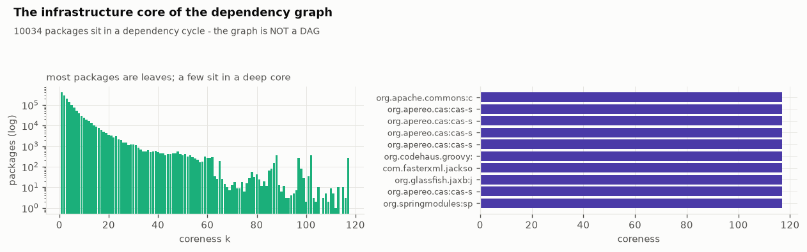

# Methodology

Every graph and statistical method the pipeline uses, each with what it computes, how it
is computed here, the literature it comes from, and the result from the full run (8
ecosystems: 4,460,049 packages, 21,415,461 versions, 82,807,953 resolved edges, 285,698
advisories). The theory summaries follow the section markdown in the
[notebook](../notebooks/supply_chain_graph_engineering.ipynb); the numbers are from
[`../results/`](../results).

A note on scope. The structural analyses run on the **package-level graph** (package A
points to package B if any version of A resolves to any version of B), which has
6,682,795 edges collapsed from the 82,807,953 version-level `RESOLVES_TO` edges. The
temporal analyses run on the version-level graph, which carries publish dates. Where this
matters it is stated.

---

## 1. Degree distribution and the power-law test

**What it computes.** The in-degree of a package is how many other packages depend on it;
the out-degree is how many it declares. The question is whether the in-degree
distribution is heavy-tailed, and specifically whether it follows a power law
`P(k) proportional to k^(-alpha)`, which would mean a small number of packages carry the
ecosystem and targeted analysis of the head is worth more than uniform sampling.

**How it is computed here.** `graphshape.degree_stats` reports mean, median, p90, p99, max
and zero fraction for both directions. `graphshape.powerlaw_mle` fits the exponent by the
Clauset-Shalizi-Newman maximum-likelihood estimator for a discrete power law with a lower
cutoff `xmin`:

```
alpha = 1 + n / sum_i ln( k_i / (xmin - 0.5) )     over k_i >= xmin
```

and reports a crude Kolmogorov-Smirnov distance to the fitted CDF. That KS number alone
cannot say whether "power law" is the right model, so `graphshape.powerlaw_gof` runs the
Clauset-Shalizi-Newman bootstrapped goodness-of-fit test: draw many synthetic datasets
of the same size from the fitted power law, fit each one, and compute the fraction whose
own KS distance is at least the observed KS. That fraction is the p-value. `p >= 0.1`
means a power law is plausible; `p < 0.1` rejects it. The discrete power-law CDF uses the
Hurwitz zeta function (`scipy.special.zeta`).

**Literature.** A. Clauset, C. R. Shalizi, M. E. J. Newman, "Power-Law Distributions in
Empirical Data", SIAM Review 51(4), 2009. The bootstrapped goodness-of-fit procedure is
section 4 of that paper.

**Full-run result.** In-degree `alpha = 1.957` (`xmin = 2`, tail of 285,674 packages),
crude KS 0.376. The Clauset bootstrapped test gives corrected KS 0.0479 and
**p = 0.0 over 300 bootstrap resamples: the power law is rejected**. Out-degree
`alpha = 1.918`, KS 0.0874, `p = 0.0`, also rejected
([`powerlaw_gof.json`](../results/metrics/powerlaw_gof.json)). The distribution is
heavy-tailed (in-degree mean 1.50, max 90,850; 87.7 percent of packages have nothing
depending on them) but it is not scale-free. At a tail size of 285,674 the strict test
rejects almost all real data, so the honest reading is "heavy-tailed, the head dominates,
a lognormal or a power law with an exponential cutoff fits better", and calling the graph
"scale-free" would be an overclaim that the dependency-graph literature routinely makes
without running the test.


---

## 2. k-core decomposition

**What it computes.** The coreness of a node is the largest `k` such that the node sits in
a subgraph where every node has degree at least `k`. High coreness means deeply embedded
infrastructure; coreness 0 or 1 means a leaf. The k-core is the standard way to peel a
graph down to its structurally non-trivial spine.

**How it is computed here.** `graphshape.kcore` implements Batagelj-Zaversnik bucket
peeling: sort nodes by current degree, repeatedly remove the minimum-degree node and
decrement its neighbours, and record the degree at which each node was removed. This is
`O(E)`. Above one million nodes the pure-Python peel is slow, so the module uses
`python-igraph`'s C implementation (`coreness(mode="all")`), which gives the identical
result about 100 times faster.

**Literature.** V. Batagelj, M. Zaversnik, "An O(m) Algorithm for Cores Decomposition of
Networks", 2003. The concept is S. B. Seidman, "Network structure and minimum degree",
Social Networks 5, 1983.

**Full-run result.** k-core runs in 3.8 s on the package graph
([`timing.json`](../results/metrics/timing.json)). Most packages are leaves; a small dense
core carries the ecosystem, and the temporal GraphSAGE task (section 9) is restricted to
the 2-core of the giant component, 916,738 packages, because degree-1 nodes carry no
neighbourhood signal.



---

## 3. Connected components, DAG depth, cycles

**What it computes.** Weakly connected components (ignore edge direction) show how
fragmented the ecosystem is. Strongly connected components of size greater than 1 **are**
dependency cycles: a resolver cannot emit a cycle, but a declared graph can have them
because npm permits circular `require`. Longest path in the acyclic condensation bounds
worst-case traversal depth.

**How it is computed here.** `graphshape.components` uses `scipy.sparse.csgraph`
(`connected_components`) for both the weak and strong variants. `graphshape.dag_depth`
does a topological longest-path dynamic program, `O(V + E)`, and reports the level sizes.
`graphshape.sample_distances` runs BFS from a sample of sources to estimate the effective
diameter, because the exact diameter is `O(VE)` and infeasible here; the effective
diameter is the 90th percentile of sampled shortest-path lengths.

**Literature.** R. E. Tarjan, "Depth-first search and linear graph algorithms", SIAM
J. Comput. 1(2), 1972 (strongly connected components). The effective-diameter definition
follows Leskovec-Kleinberg-Faloutsos (section 8).

**Full-run result** ([`graph_shape.json`](../results/metrics/graph_shape.json)):

- Weakly connected components: 3,005,952, the largest holding **1,219,685 packages, 27.3
  percent of the graph**.
- Strongly connected components larger than 1: **2,366, containing 10,034 packages**. The
  dependency graph is **not a DAG**.
- Longest dependency chain: **28 hops**. Effective diameter (p90 of sampled shortest
  paths): 16. Mean sampled path length: 9.9.

---

## 4. Articulation points and bridges

**What it computes.** An articulation point (cut vertex) is a node whose removal increases
the number of connected components: there is no path around it, so it is a true single
point of failure. A bridge is the edge analogue: an edge with no alternate route, a
dependency the ecosystem has no redundancy for. These are purely topological, sharper
than any spectral notion of importance.

**How it is computed here.** `centrality.articulation_points_and_bridges` runs
Hopcroft-Tarjan on the undirected package graph: a single depth-first search tracking
`disc[v]` (discovery time) and `low[v]` (the earliest-discovered node reachable from the
subtree of `v`). A non-root `v` is an articulation point if it has a child `w` with
`low[w] >= disc[v]`; the root is one if it has two or more DFS children; an edge
`(u, v)` is a bridge if `low[v] > disc[u]`. The DFS is **iterative with an explicit
stack** because the dependency graph is deep enough to exceed Python's recursion limit.
Above 500,000 nodes the module uses `python-igraph`'s C implementation.

**Literature.** J. Hopcroft, R. Tarjan, "Efficient algorithms for graph manipulation",
Communications of the ACM 16(6), 1973.

**Full-run result** ([`criticality.json`](../results/metrics/criticality.json)):
**88,273 articulation points (2.0 percent of packages) and 386,554 bridges**. The
most-depended-on cut vertices are exactly the packages a working engineer would name:
`lodash`, `react`, `chalk`, `request`, `commander`, `express`, `react-dom`, `moment`,
`fs-extra`, `debug`. Articulation and bridge detection runs in 7.5 s on the full package
graph.

---

## 5. Betweenness centrality with a sample bound

**What it computes.** The betweenness of a node is the fraction of all shortest paths that
pass through it: how much traffic would route through this package. It identifies
different packages than PageRank or in-degree do.

**How it is computed here.** Exact betweenness is the Brandes algorithm, `O(VE)`, which is
on the order of 10^15 operations for this graph and infeasible. `centrality.betweenness_sampled`
runs Brandes accumulation from `K` sampled source pivots and scales by `n / K`. The number
of pivots needed for a uniform approximation is the **Riondato-Kornaropoulos** bound:

```
K >= (c / eps^2) * ( floor(log2(VD - 2)) + 1 + ln(1/delta) )
```

where `VD` is the vertex diameter, `eps` the additive error, `delta` the failure
probability, and `c` a small constant. This gives an `eps`-approximation of *every*
node's betweenness with probability `1 - delta`. The implementation also takes a BFS hop
cutoff (paths longer than about eight hops carry negligible betweenness mass and cost the
most) and a pivot pool so pivots can be restricted to the spine, which is where the
betweenness mass lives. For the full run there is a hard degree-truncation and a
wall-clock timeout with a fallback, because an early version of the cap did not hold on a
dense real cluster and ran unbounded (see [evaluation.md](evaluation.md), bug list).

**Literature.** U. Brandes, "A Faster Algorithm for Betweenness Centrality", Journal of
Mathematical Sociology 25(2), 2001. M. Riondato, E. M. Kornaropoulos, "Fast approximation
of betweenness centrality through sampling", WSDM 2014 (extended in Data Mining and
Knowledge Discovery, 2016).

**Full-run result.** Sampled Brandes with 60 pivots on the 20-core (8,000 nodes); the
Riondato-Kornaropoulos bound for the target error was 3,061 pivots, and the run hit its
150-second budget and fell back to the reduced sample (166 s of work,
[`criticality.json`](../results/metrics/criticality.json), `timing.json`). The Spearman
rank correlation between betweenness and reverse-PageRank over connected packages is
**-0.06**, and between in-degree and reverse-PageRank is **-0.13**: no single centrality
is "the" centrality, and raw popularity anti-correlates slightly with systemic position.


---

## 6. Reverse PageRank, blast radius, and the single-maintainer counterfactual

**What it computes.** This is the xz-utils question asked across the whole graph: if one
package or one maintainer is compromised, how much of the ecosystem is exposed? Three
lenses.

- **Reverse PageRank.** Run PageRank on the reversed dependency graph, so probability mass
  flows toward widely-depended-on packages. The stationary distribution ranks how
  load-bearing each package is.
- **Blast radius.** For each package, the number of application packages whose transitive
  dependency closure contains it.
- **Single-maintainer compromise.** Mark a package malicious, propagate "exposed" along
  reverse edges, and count the reachable application packages. This is the honest upper
  bound on a supply-chain attack through that package.

**How it is computed here.** `systemic.pagerank_rev` is power iteration on the reverse
CSR: about 40 sparse matrix-vector products, `O(E)` each, damping 0.85, with dangling-mass
redistribution. `systemic.blast_radius` uses `scipy.sparse.csgraph` breadth-first search
from the application-package set (the tail: packages with dependencies but no
dependents). `systemic.compromise_sim` is a reverse-reachability flood from the victim.
The concentration of the PageRank vector is summarised by the **Gini coefficient**, from 0
(every package equally central) to 1 (one package holds all influence), computed over the
connected core only because the corpus also holds roughly 200,000 isolated nodes
(packages named only by malware advisories, with no edges) that would flatten any global
statistic.

**Literature.** L. Page, S. Brin, R. Motwani, T. Winograd, "The PageRank Citation
Ranking: Bringing Order to the Web", Stanford technical report, 1999. C. Gini, "Variabilita
e mutabilita", 1912.

**Full-run result** ([`systemic.json`](../results/metrics/systemic.json)):
**reverse-PageRank Gini over the connected core is 0.262**. Reverse PageRank runs in 4.3 s.
The naive top of the ranking is npm kitchen-sink spam (`all-of-them`, `all-packages-143`,
`wowdude-39`, `neat-133`) that depends on everything; that is an honest artefact the
analysis flags rather than a real result, and it is why the criticality analysis leans on
articulation points and bridges as well.


---

## 7. The laws of graph growth: densification and preferential attachment

**What it computes.** Libraries.io stamps every version with a publish date. Assign each
`RESOLVES_TO` edge the publish date of its source version (the edge came into being when
that version shipped) and the graph becomes a movie. Two classical results.

- **Densification power law.** `|E(t)|` grows as `|V(t)|^a`. `a = 1` means constant
  average degree; `a > 1` means the graph densifies, each cohort of new packages
  depending on more existing ones than the last. Fit `a` by ordinary least squares on
  `log|V|` against `log|E|` across yearly snapshots.
- **Preferential attachment.** Freeze the graph at year `Y`; for each edge that appears
  after `Y`, record the in-degree at `Y` of the node it attached to. The attachment
  kernel is `P(attach to a node of in-degree k)` divided by `P(a pre-existing node has
  in-degree k)`. A linear kernel (slope near 1) is the Barabasi-Albert "rich get richer"
  model; a super-linear kernel is winner-takes-all.

**How it is computed here.** `temporal.edge_times` extracts source-version dates,
`temporal.snapshots` builds a CSR for each yearly prefix of the time-sorted edge list (one
sort, then `k` cheap CSR builds), `temporal.densification_law` runs the OLS fit, and
`temporal.attachment_kernel` bins by degree geometrically and fits the log-log slope.
`temporal.pagerank_trajectory` recomputes reverse PageRank for a watch-list of packages at
each snapshot using a SciPy sparse build per prefix.

**Literature.** J. Leskovec, J. Kleinberg, C. Faloutsos, "Graphs over Time: Densification
Laws, Shrinking Diameters and Possible Explanations", KDD 2005. A.-L. Barabasi, R. Albert,
"Emergence of Scaling in Random Networks", Science 286, 1999.

**Full-run result** ([`graph_growth.json`](../results/metrics/graph_growth.json)): 10
yearly snapshots from 2011 to 2020; the graph grew from 96,267 to 13,917,908 dated
version nodes and from 288,952 to 81,729,022 edges; mean degree rose from 3.0 to 5.9.
**Densification exponent `a = 1.153`, R-squared 0.9977**: a clean confirmation that the
software supply chain densifies. The **preferential-attachment kernel slope is 0.936**
over 63,561,437 post-2017 edges, consistent with roughly linear Barabasi-Albert
attachment rather than winner-takes-all.


---

## 8. Community detection and modularity

**What it computes.** k-core and centrality ask how deep or how central a package is;
community detection asks the orthogonal question of which neighbourhood it belongs to, and
whether the ecosystem breaks into coherent sub-ecosystems at all.

**How it is computed here.** `community.label_propagation` implements the
Raghavan-Albert-Kumara method: every node repeatedly adopts the label most common among
its neighbours, with asynchronous updates, a seeded node permutation and a random
tie-break so the result is deterministic given the seed. Each sweep is `O(E)` and a
handful of sweeps reach a fixed point. `community.modularity` scores the labelling by the
Newman-Girvan modularity `Q`: the fraction of edges that fall inside communities minus the
fraction expected under a degree-preserving null model. `Q > 0.3` means the partition
captures real structure; `Q near 0` means it does not. `community.community_report` also
reports the cross-community edge fraction (the integration seams) and the dominant
ecosystem and purity of each large community.

**Literature.** U. N. Raghavan, R. Albert, S. Kumara, "Near linear time algorithm to
detect community structures in large-scale networks", Physical Review E 76, 2007.
M. E. J. Newman, M. Girvan, "Finding and evaluating community structure in networks",
Physical Review E 69, 2004.

**Full-run result** ([`community.json`](../results/metrics/community.json)):
**modularity `Q = 0.518`**, well above the 0.3 threshold, over 13,559 communities of at
least three members, the largest holding 786,342 packages. Only **5.2 percent of edges
cross a community boundary**. The large communities are ecosystem-pure (purity 1.0): the
dependency graph partitions along ecosystem lines (npm, NuGet, Maven, Packagist, PyPI,
Cargo, RubyGems), it does not form cross-ecosystem tool families, because there are
almost no cross-ecosystem resolved edges to begin with. Label propagation runs in about
216 s on the full graph.


---

## 9. Temporal, leakage-free node classification: GraphSAGE vs a tabular baseline

**What it computes.** Whether a *learned* function of graph position predicts where the
next CVE lands, and specifically whether neighbourhood message-passing beats the same
features fed to a non-graph model. The task is built so the answer can be "no".

**The task.** Freeze the graph and every node's features at year `Y`. Label a package
positive if its first advisory is published in the window `(Y, Y+H]`. Train on `Y = Y0`,
select the operating threshold on `Y0 + H`, test on `Y0 + 2H`. Features come only from
edges and metadata with timestamp at most `Y`; labels come only from advisories published
after `Y`. This is the discipline of a backtest: no peeking at the future.

**How it is computed here.** `gnn.node_features` assembles a feature matrix from
`log1p`-transformed structural signals: in-degree, out-degree, reverse PageRank, k-core,
version count, package age, and a one-hot ecosystem vector. `gnn.two_core_of_giant`
restricts to the 2-core of the giant weakly-connected component (the structurally
non-trivial subgraph; degree-1 nodes carry no neighbourhood signal, and the restriction
is reported, not hidden). `gnn.train_graphsage` is a 2-layer GraphSAGE with a mean
aggregator, full-batch, in pure PyTorch sparse operations. `gnn.train_tabular` fits
logistic regression and gradient boosting on the identical features. Because the base
rate is one or two percent, the primary metric is **Average Precision** (area under the
precision-recall curve) and precision-at-k, not AUROC. `gnn.bootstrap_delta` puts a
bootstrap 95 percent confidence interval on the GraphSAGE-minus-best-tabular AP delta.

**Literature.** W. L. Hamilton, R. Ying, J. Leskovec, "Inductive Representation Learning
on Large Graphs", NeurIPS 2017 (GraphSAGE).

**Full-run result** ([`gnn.json`](../results/metrics/gnn.json), 2-core of 916,738 nodes,
`Y0 = 2015`, horizon 2 years, test set 138,276 nodes with 1,028 positives, base rate
0.74 percent):

| model | AUROC | AP | precision@100 |
|---|---|---|---|
| GraphSAGE | 0.80 | 0.099 | 0.32 |
| logistic regression | 0.75 | 0.088 | 0.33 |
| gradient boosting | 0.74 | 0.083 | 0.40 |

The bootstrapped AP delta of GraphSAGE over the best tabular model is **+0.013, 95 percent
confidence interval [0.005, 0.021]**, with an estimated probability of 0.998 that
GraphSAGE is better (the delta is a paired resample of the test set, not the difference of
the point estimates in the table). Message-passing beats the identical features in a
non-graph model, but the interval only just clears zero: the honest and common finding on
dependency graphs is that structural features already encode most of what the
neighbourhood would tell you.


---

## 10. Semantic relevance

**What it computes.** A path proves that an affected version is present in the tree, not
that the vulnerable code is relevant to how the package is used. The signal that separates
a real exposure from a spurious one is the similarity between the advisory text and the
package identity, independent of graph structure.

**How it is computed here.** `embed.embed_texts` encodes text with the BGE-small English
model (`BAAI/bge-small-en-v1.5`, 384 dimensions), using length-sorted super-shards so
every batch is roughly uniform and no GPU time is wasted on padding. The evaluation
(`embed.semantic_relevance`) builds real pairs (an advisory summary and the package it
actually affects) and control pairs (the same advisory summary and a different package in
the same ecosystem), computes cosine similarity for each, and reports the AUROC of
separating real from control. The model is never asked what is true, only how similar two
strings are.

**Literature.** S. Xiao, Z. Liu, P. Zhang, N. Muennighoff, "C-Pack: Packaged Resources
To Advance General Chinese Embedding", 2023 (the BGE family).

**Full-run result** ([`semantic_relevance.json`](../results/metrics/semantic_relevance.json)):
**AUROC 0.955** over 400 real and 400 control pairs (mean cosine 0.731 real versus 0.578
control). The caveat, stated plainly: advisory summaries routinely name or characterise
the package ("Prototype Pollution in lodash", "RCE in Apache Commons Text"), so this
number is **partly lexical overlap**, not purely semantic understanding. It measures
whether the embedding picks the truly-affected package over a same-ecosystem impostor,
which it does well, but it is not evidence that the model understands the vulnerability
mechanism.

---

## 11. CVSS base-score arithmetic

**What it computes.** OSV stores severity as a CVSS vector string, for example
`CVSS:3.1/AV:N/AC:L/PR:N/UI:N/S:U/C:H/I:H/A:H`, not as a number. The base score is a
fully specified deterministic function of the vector. No model is involved.

**How it is computed here.** `cvss.score_v3` implements the FIRST CVSS v3.1 formula: the
impact sub-score from the confidentiality, integrity and availability metrics; the
exploitability sub-score from attack vector, attack complexity, privileges required and
user interaction; the scope-change branch; and the round-up to one decimal place.
`cvss.band` maps the score to Critical (at least 9.0), High (at least 7.0), Medium (at
least 4.0), Low (above 0) or None. CVSS v4.0 base scoring is a lookup table; the module
approximates it from the v3-equivalent metrics and marks that it did so.

**Literature.** FIRST, "Common Vulnerability Scoring System v3.1: Specification Document",
section 7.1. FIRST, "CVSS v4.0 Specification".

**Full-run result** ([`temporal.json`](../results/metrics/temporal.json)): across 285,698
advisories the mean CVSS base score is 6.92. The `judge` instrument check confirms that
the vector string carries the severity signal: a Qwen3-14B model handed the vector
recovers the band with 0.875 accuracy, against a constant-predictor baseline of 0.53 (see
[evaluation.md](evaluation.md)).

---

## 12. Minimal remediation: weighted set cover and an integer program

**What it computes.** The smallest set of version bumps that clears every advisory reaching
a manifest, without entering a new affected range or crossing a major-version boundary.

**How it is computed here.** This is weighted set cover, NP-hard, so two solvers are
reported. `remediate.greedy_fix` is the Chvatal greedy heuristic: per affected package,
take the lowest clean non-prerelease version at or above the current one. It always
terminates and gives an upper bound on the bump count. `remediate.ilp_fix` is the exact
formulation: binary variables `y[p,v]` choose version `v` of package `p`; one-hot
constraints force one version per package; a hard linear constraint requires the chosen
version to be advisory-free; the objective is `number of bumps + lambda * number of major
bumps`. It is solved with `scipy.optimize.milp`, which wraps the HiGHS
branch-and-bound solver. The ILP surfaces trees where fixing one package forces a
downgrade of another and no assignment satisfies everything, which greedy silently misses.

**Literature.** V. Chvatal, "A Greedy Heuristic for the Set-Covering Problem", Mathematics
of Operations Research 4(3), 1979. Q. Huangfu, J. A. J. Hall, "Parallelizing the dual
revised simplex method", Mathematical Programming Computation, 2018 (HiGHS).

**Full-run result** ([`exp_remediation.json`](../results/metrics/exp_remediation.json)):
of 2,177 exposed manifests, **641 have a remediation, 2,105 contain a package with no safe
fix, and 367 need a major bump**. The unfixable fraction is the important number: for most
real trees, "just upgrade" is not an option that the published version history supports.

---

## 13. Differential graph analysis: a remediation is a graph edit

**What it computes.** The effect of a proposed fix, evaluated by re-running the graph
queries on both sides of the edit rather than only re-checking the package that was asked
about. Three things a naive check misses: the bump can itself enter another advisory's
affected range ("upgraded to fix CVE-A, shipped CVE-B"); the bump changes the tree shape
because the new version has different dependencies; and the fix has a blast radius of its
own in every other manifest that pins the same package.

**How it is computed here.** `whatif.diff_manifest` builds a redirect overlay (a dict
mapping every old version id of a bumped package to the new version id), walks the
resolved tree before and after honouring the overlay, and returns the set of advisories
cleared, the set introduced, the depth change and the CVSS-mass change. The overlay makes
a what-if cost `O(affected subtree)` rather than a graph rebuild. `whatif.portfolio_delta`
aggregates over every proposed remediation, and `whatif.fix_ripple` counts the manifest
roots that contain a given package via one bounded reverse walk.

**Literature.** This is differential or "what-if" analysis over a graph edit; the survey
frames the same idea as re-running queries against a versioned run graph (section 4.4 of
arXiv:2608.21156v2).

**Full-run result** ([`whatif_portfolio.json`](../results/metrics/whatif_portfolio.json)):
across the 641 fixable manifests the greedy fixes clear 2,334 advisories but **introduce
317**, move total CVSS mass from 139,316.6 to 128,519.5, and leave **28 manifests net
worse** (advisories introduced greater than or equal to advisories cleared), with zero
no-ops. A representative net-worse case is `rubygems/refinerycms-pods@2.1.1`: minus 7
advisories, plus 15 introduced. This is the concrete argument for evaluating a fix on both
sides of the graph.

---

## 14. The over-claim bound on advisory ranges

**What it computes.** An OSV `affected` range such as `< 2.15.0` over a package with 400
releases marks every prior version affected, including ones where the vulnerable code did
not yet exist. Structural "in range" is therefore an upper bound on real exposure, and
alert precision against it is capped. The over-claim is the gap between the range-implied
version set and any tighter explicit `versions` list the advisory also carries.

**How it is computed here.** For advisories that carry both a range and an explicit
`versions` list, `versions.in_osv_range` is evaluated for each listed version and the
fraction of range-implied marks that are not in the explicit list is measured.

**Full-run result:** structural "in range" over-claims by **about 1 percent** where it can
be checked ([`scorecard.json`](../results/scorecard.json)). This is small, but it is a
lower bound on the real over-claim, because the check only applies to the minority of
advisories that carry an explicit list; the reachability layer (gate 7) and curator
narrowing are what close the rest.

---

## 15. The reachability prior

**What it computes.** A conservative, model-free verdict on whether a present-but-affected
package is actually on a live call path, from graph structure alone: the dependency kind
(a dev-only or optional dependency is not shipped), the depth, whether the affected
package is a direct dependency of the root, and whether the OSV record names a specific
vulnerable symbol.

**How it is computed here.** `reach.reachability_prior` returns `reachable` for a direct
dependency or a CVSS score of at least 9.0, `unreachable` for a dev or optional
dependency or for a deep low-severity path with no named symbol, and `undetermined`
otherwise. It is deliberately biased toward `undetermined`: it only says `unreachable`
when the evidence is strong. The intended replacement is a static call-graph analysis
(jelly or js-callgraph for JavaScript, PyCG for Python, java-callgraph or OPAL for the
JVM) validated against OpenSSF and OSV VEX "not affected" statements; that runs on a GPU and its precision does not transfer across ecosystems, so it is always reported
per ecosystem, never pooled.

**Full-run result** ([`exp_reachability.json`](../results/metrics/exp_reachability.json)):
over 9,853 (manifest, advisory) pairs the prior returns **20 percent reachable, 79 percent
undetermined, 0.6 percent unreachable**, and applying it as gate 7 moves the alert count
only from 9,853 to 9,789. The structural prior is far too conservative at scale to be
useful on its own; a real call-graph gate is needed to move the number, and that is
reported honestly rather than presented as a suppression win.


---

## 16. Counterfactual ablation (the causal test)

**What it computes.** "Anything untraceable is not alerted" is a causal claim: remove the
evidence and the system must stop alerting. Ablation provides a negative condition whose
label the pipeline did not write.

**How it is computed here.** Graph elements are deleted in four nested tiers: T0 is the
full graph; T1 removes the single shallowest affected terminal per manifest; T2 adds every
depth-1 affected terminal; T3 adds every affected terminal. Because each drop-set is a
superset of the previous one, a well-behaved system's alert count is monotone by
construction, and the test is whether it actually is, and whether it reaches zero at T3.

**Full-run result** ([`exp_ablation.json`](../results/metrics/exp_ablation.json)): the
curve is **4,084, 3,691, 3,545, 0 across 40 manifests, monotonic**. Alerts track evidence.
The caveat is in [evaluation.md](evaluation.md): monotonicity under nested drop-sets is a
consistency check, not a proof of a causal mechanism, and it is labelled as such.

---

## 17. Method-to-module map

| method | module | function | result file |
|---|---|---|---|
| power-law MLE and goodness-of-fit | `graphshape` | `powerlaw_mle`, `powerlaw_gof` | `powerlaw_gof.json`, `graph_shape.json` |
| k-core | `graphshape` | `kcore` | `graph_shape.json` |
| components, DAG depth, distances | `graphshape` | `components`, `dag_depth`, `sample_distances` | `graph_shape.json` |
| articulation points, bridges | `centrality` | `articulation_points_and_bridges` | `criticality.json` |
| sampled betweenness | `centrality` | `betweenness_sampled`, `betweenness_core` | `criticality.json` |
| reverse PageRank, blast radius, compromise | `systemic` | `pagerank_rev`, `blast_radius`, `compromise_sim`, `gini` | `systemic.json` |
| densification, attachment, trajectories | `temporal` | `densification_law`, `attachment_kernel`, `pagerank_trajectory` | `graph_growth.json` |
| label propagation, modularity | `community` | `label_propagation`, `modularity`, `community_report` | `community.json` |
| temporal GraphSAGE, tabular baseline | `gnn` | `train_graphsage`, `train_tabular`, `bootstrap_delta` | `gnn.json` |
| semantic relevance | `embed` | `embed_texts`, `semantic_relevance` | `semantic_relevance.json` |
| CVSS arithmetic | `cvss` | `score_v3`, `band` | (used throughout) |
| greedy and ILP remediation | `remediate` | `greedy_fix`, `ilp_fix` | `exp_remediation.json` |
| differential graph analysis | `whatif` | `diff_manifest`, `portfolio_delta`, `fix_ripple` | `whatif_portfolio.json` |
| reachability prior | `reach` | `reachability_prior`, `reachability_map` | `exp_reachability.json` |
| counterfactual ablation | (notebook S13) | driven by `paths` and `ladder` | `exp_ablation.json` |

See [results.md](results.md) for these numbers read together in context, and
[evaluation.md](evaluation.md) for where each one is weak.
