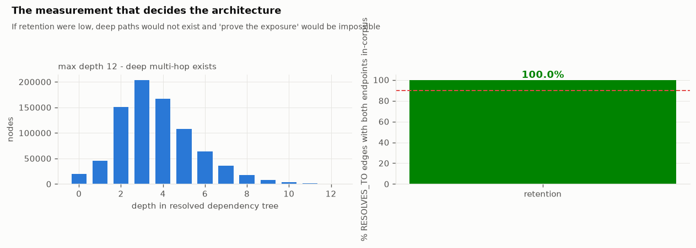
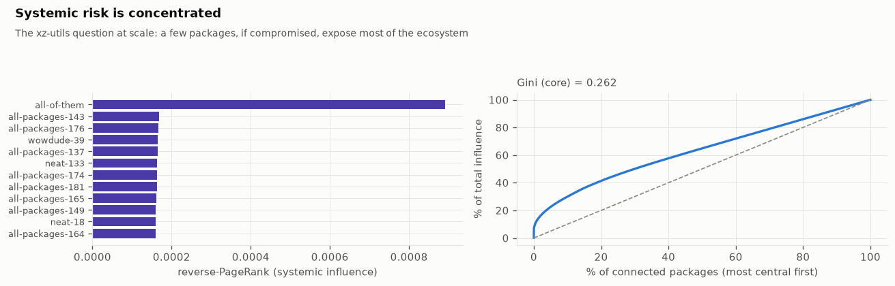
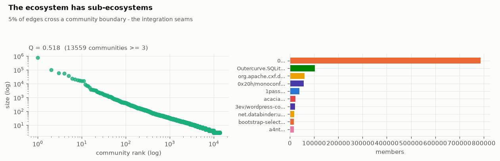
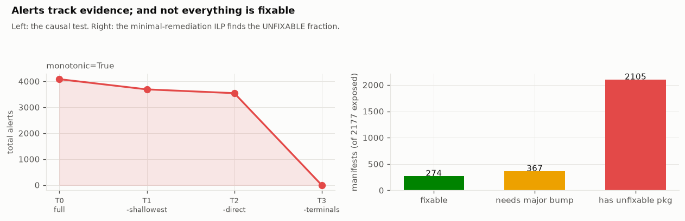
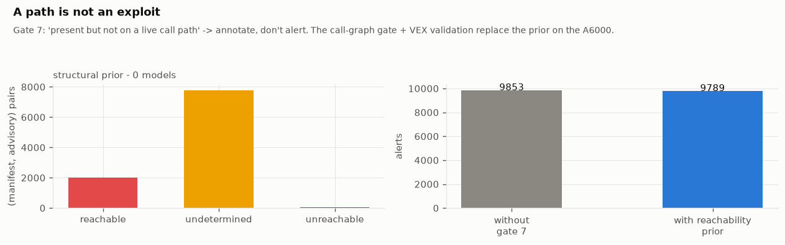
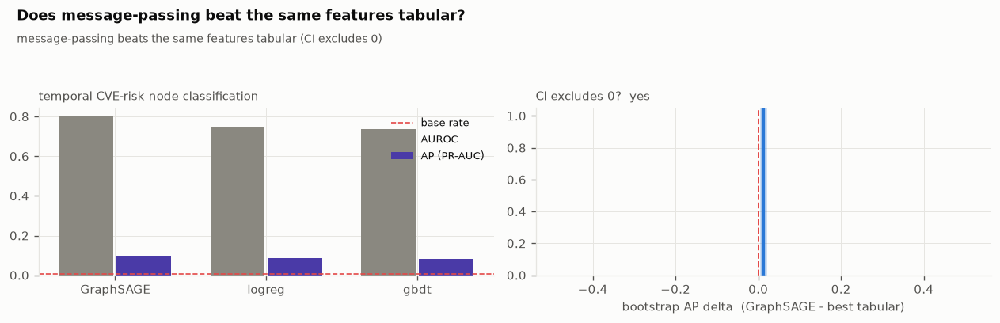
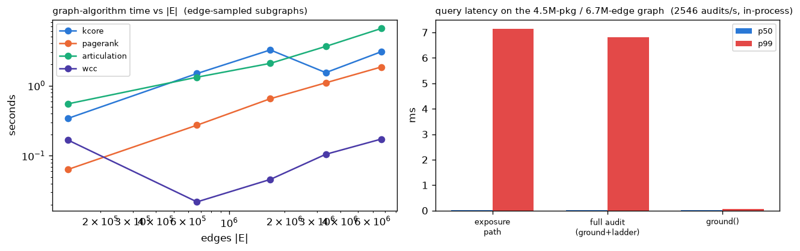
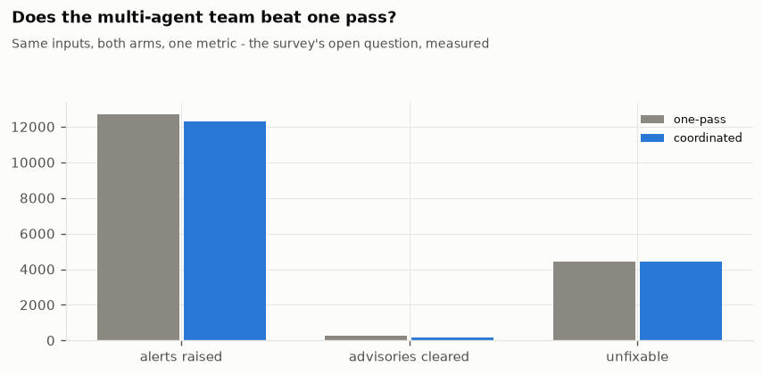
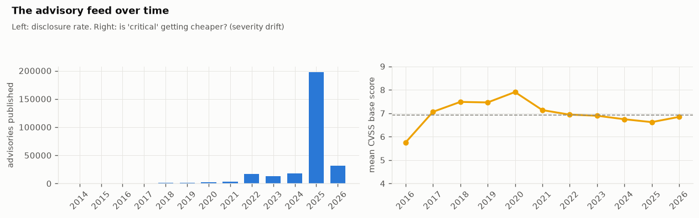

# Results

The findings from the full run (8 ecosystems, `SMOKE_TEST=False`, 2026-09-01), grouped by
theme. Each entry gives the number, what it means, and the honest reading. Every figure is
committed under [`figures/`](figures); every number is in
[`../results/run_manifest.json`](../results/run_manifest.json) and
[`../results/scorecard.json`](../results/scorecard.json).

Two claims are kept separate throughout and never blended into one end-to-end score:

- **Safety:** every "affected" verdict carries a concrete resolvable path; every "not
  affected" is a proven graph absence or an explicit "path exists, reachability
  unverified".
- **Quality:** does routing triage through the graph reduce review burden or catch
  exposures a flat scanner misses, at acceptable coverage.

---

## 1. Graph scale

| quantity | value |
|---|---|
| packages | 4,460,049 |
| versions | 21,415,461 |
| resolved (`RESOLVES_TO`) edges | 82,807,953 |
| advisories | 285,698 |
| materialised affected edges | 1,350,518 |
| package-level dependency edges | 6,682,795 |
| LLM calls to build the graph | 0 |

**What it means.** The graph spans the open-source dependency ecosystem at a scale that is
only reachable because construction is field extraction, not model-driven extraction. A
model-prompted approach on the GraphRAG cost model would be on the order of tens of
thousands of dollars for a single dataset; here the marginal cost of another million
packages is disk and parse time.

**The honest reading.** "Retention" in the run manifest's decision block reads 100
percent, but that figure is a tautology: an edge is only emitted if both endpoints were
interned as version nodes, so of course both endpoints exist. The number that matters is
**parse retention: 96.64 percent** of declared dependencies found a satisfying published
version in the snapshot (2.88 million of 85.8 million declared dependencies are dangling
stubs). That gap is real and non-trivial, and it is a genuine property of the data, not a
resolver failure. Resolver logic is validated separately (section 7).

---

## 2. Shape

| quantity | value |
|---|---|
| in-degree power-law exponent (MLE) | alpha = 1.957 |
| Clauset bootstrapped goodness-of-fit | p = 0.0, power law rejected |
| packages in a dependency cycle | 10,034 (in 2,366 cycles) |
| is the graph a DAG | no |
| longest dependency chain | 28 hops |
| effective diameter (p90 sampled) | 16 |
| largest weakly connected component | 1,219,685 packages (27.3 percent) |

**What it means.** The graph is heavy-tailed: a handful of packages carry the ecosystem,
which is why the criticality analysis targets the head rather than sampling uniformly.
Deep transitive paths exist (a 28-hop chain, a p90 effective diameter of 16), so "prove
the exposure with a path" is a real problem and not a one-hop lookup. The graph is not
acyclic, because declared dependencies can be circular.

**The honest reading.** The dependency-graph literature routinely calls these graphs
"scale-free". The strict Clauset test **rejects** a pure power law (p = 0.0 for both in-
and out-degree). At a tail of 285,674 packages the test rejects almost any real
distribution, so the takeaway is "heavy-tailed, the head dominates", not "scale-free". A
lognormal or a power law with an exponential cutoff is a better description, and which one
is neither resolvable at this scale nor important for the downstream analysis.

---

## 3. Structural criticality

| quantity | value |
|---|---|
| articulation points | 88,273 (2.0 percent of packages) |
| bridges | 386,554 |
| Spearman(in-degree, reverse-PageRank) | -0.13 |
| Spearman(betweenness, reverse-PageRank) | -0.06 |

**What it means.** 88,273 packages are cut vertices: removing any one of them disconnects
part of the graph, so there is no path around it. The most-depended-on cut vertices are
`lodash`, `react`, `chalk`, `request`, `commander`, `express`, `react-dom`, `moment`,
`fs-extra`, `debug`, which is the list a working engineer would produce from memory.

**The honest reading.** The centrality lenses disagree. In-degree (raw popularity) and
reverse-PageRank (systemic position) have a Spearman correlation of **-0.13**: they are
close to unrelated, and slightly anti-correlated. There is no single "most central"
ranking; each lens surfaces a different failure mode, and a real triage list needs
articulation points and bridges alongside PageRank.

---

## 4. Systemic risk

| quantity | value |
|---|---|
| reverse-PageRank Gini (connected core) | 0.262 |

**What it means.** This is the xz-utils question at ecosystem scale: if one package is
compromised, how much is exposed? A Gini of 0.262 over the connected core says systemic
influence is concentrated but not extremely so; a small set of packages carries a
disproportionate share of the load-bearing.

**The honest reading.** The naive top of the reverse-PageRank ranking is npm kitchen-sink
spam: `all-of-them`, `all-packages-143`, `wowdude-39`, `neat-133`, packages that depend on
everything as a joke or a stress test. That is an artefact the analysis flags, not a real
finding, and it is why the criticality story leans on articulation points and bridges,
which are not fooled by a package that declares thousands of dependencies but has nothing
depending on it.

---

## 5. Evolution

| quantity | value |
|---|---|
| densification exponent | a = 1.153 (R-squared 0.9977) |
| mean degree, 2011 to 2020 | 3.0 to 5.9 |
| preferential-attachment kernel slope | 0.936 |
| community modularity Q | 0.518 |
| cross-community edge fraction | 5.2 percent |

**What it means.** The dependency graph densifies: `|E|` grows as `|V|` to the power
1.153, so each cohort of new packages depends on more existing ones than the last. This is
a clean confirmation of the Leskovec-Kleinberg-Faloutsos densification law on real
software supply-chain data. New edges attach roughly in proportion to existing in-degree
(kernel slope 0.936), the linear Barabasi-Albert regime, not winner-takes-all. The graph
has real community structure (Q = 0.518, well above the 0.3 threshold) with only 5.2
percent of edges crossing a community boundary.

**The honest reading.** The communities are ecosystem-pure: they partition along npm,
NuGet, Maven, Packagist, PyPI, Cargo, RubyGems lines rather than forming cross-ecosystem
tool families. That is expected, because there are almost no cross-ecosystem resolved
edges; the modularity number is real structure, but the structure it finds is mostly "npm
is not PyPI".

---

## 6. Remediation

| quantity | value |
|---|---|
| exposed manifests | 2,177 |
| manifests with a remediation | 641 |
| manifests containing a package with no safe fix | 2,105 |
| manifests needing a major bump | 367 |
| advisories cleared by the greedy fixes | 2,334 |
| advisories introduced by the greedy fixes | 317 |
| manifests left net worse | 28 |
| total CVSS mass, before to after | 139,316.6 to 128,519.5 |

**What it means.** For most exposed manifests, "just upgrade" is not supported by the
published version history: **2,105 of 2,177** contain at least one package with no
advisory-free version at or above the current one without a major bump. The integer
program surfaces this where a greedy solver would silently pick a compromise.

**The honest reading.** Even the fixes that do exist are not clean. Across the 641 fixable
manifests, the greedy bumps **introduce 317 new advisories** (the new version sits in
another advisory's range) and leave **28 manifests net worse**, for example
`rubygems/refinerycms-pods@2.1.1`: minus 7 advisories, plus 15 introduced. A remediation
is a graph edit, and it has to be evaluated on both sides of the edit, which is what
`whatif.diff_manifest` does.

---

## 7. The alert ladder and reachability

| quantity | value |
|---|---|
| counterfactual ablation curve (T0 to T3) | 4,084, 3,691, 3,545, 0 |
| ablation monotonic | yes |
| structural over-claim vs explicit version lists | about 1 percent |
| reachability prior: reachable / undetermined / unreachable | 20 percent / 79 percent / 0.6 percent |
| alerts, without gate 7 to with the reachability prior | 9,853 to 9,789 |

**What it means.** The alert count falls monotonically to zero as the affected terminals
are removed from the graph in nested tiers: alerts track evidence. Structural "in range"
over-claims real exposure by only about 1 percent where a tighter explicit list exists to
check against.

**The honest reading.** The structural reachability prior barely moves the alert count
(9,853 to 9,789). It is deliberately conservative, returning `undetermined` for 79 percent
of pairs. Meaningful reachability gating needs a real static call-graph analysis, which
runs on a GPU and whose precision does not transfer across ecosystems. The
"anything untraceable is not alerted" property is real; the reachability filter on top of
it is, for now, weak, and that is reported rather than dressed up.

---

## 8. The model layer

| signal | result | baseline / control |
|---|---|---|
| semantic relevance (BGE-small, real vs same-ecosystem control) | AUROC 0.955 | control mean cosine 0.578 vs real 0.731 |
| temporal GraphSAGE, CVE-risk node classification | AUROC 0.80, AP 0.10 | logistic regression AUROC 0.75; gradient boosting 0.74 |
| GraphSAGE vs best tabular, bootstrapped AP delta | +0.013, 95 percent CI [0.005, 0.021] | interval clears 0 |
| advisory-text severity check (Qwen3-14B, oracle) | 0.875 band accuracy | 0.53 constant-predictor baseline; 0.40 blind |

**What it means.** Advisory text carries enough package identity to pick the truly-affected
package over a same-ecosystem impostor (AUROC 0.955). A graph neural network trained with
a strict temporal split does beat the identical features in a non-graph model, with a
confidence interval that clears zero. The judge model recovers the CVSS band from the
vector string, so it is a valid measurement instrument for the severity check.

**The honest reading.** The semantic-relevance AUROC is **partly lexical overlap**:
advisory summaries name the package ("Prototype Pollution in lodash"), so this is not
evidence of understanding the vulnerability mechanism. The GraphSAGE advantage is real but
**barely**: the AP delta interval is [0.005, 0.021], which just clears zero, and the
common finding on dependency graphs holds, that structural features already encode most of
the neighbourhood signal. The judge is validated only as an instrument for one specific
task; it is not in the alerting path.

---

## 9. External validation

| comparison | result |
|---|---|
| resolver fidelity vs deps.dev (in-snapshot) | 97.2 percent agreement |
| vs `osv-scanner` over 150 generated lockfiles | 96.9 percent agreement |

**What it means.** When deps.dev's chosen version also exists in the January 2020
snapshot, `scgraph`'s resolver picks the same version **97.2 percent** of the time (npm
97.6 percent, Cargo 100 percent). Against `osv-scanner`, the reference OSV client, over 150
lockfiles generated from the graph, the two agree on **96.9 percent** of findings: 1,748
in common, 45 only from `scgraph` (deeper transitive resolution and alias mapping), 10
only from `osv-scanner` (advisories `scgraph` gates out as withdrawn or out of range).

**The honest reading.** The raw resolver agreement is only 9.3 percent, because the 2020
snapshot simply does not contain the post-2020 versions deps.dev picks; that is a
data-coverage limit, not a resolver bug, and the in-snapshot restriction isolates the
logic. The `osv-scanner` comparison is not a claim of superior recall: this is a
governance layer that gates on provenance, not a recall improvement. The disagreements are
mostly gates working as designed.

---

## 10. Performance

| quantity | value |
|---|---|
| CSR store build from Parquet | about 2.3 minutes (`osv.materialise` 28 s + `kgstore.build` 140 s) |
| KGStore load per process | 13.2 s, 16 GB peak resident set |
| full-audit latency (ground, paths, 7-gate ladder) | p50 0.02 ms, p90 0.97 ms, p99 6.8 ms |
| throughput | 2,546 full audits per second, single process |
| reverse PageRank (40 iterations) on the package graph | 4.3 s |
| articulation points and bridges | 7.5 s |
| k-core | 3.8 s |
| label propagation | 216 s |
| sampled betweenness | 166 s (hit the 150 s budget, fell back) |

**What it means.** The "CSR memmap, not a graph database" argument is a performance claim,
and the numbers support it: a full audit runs in a median of 0.02 milliseconds in
process, while a single Neo4j network round-trip alone is one to five milliseconds. Edge
sampling from 2 percent to 100 percent of the package graph shows near-linear scaling for
k-core, PageRank, articulation points and connected components
([`scaling.json`](../results/metrics/scaling.json)).

**The honest reading.** Betweenness is the exception: it does not fit the budget and falls
back to a reduced sample on the 20-core. Label propagation at 216 seconds is the slowest
of the tractable algorithms. The interactive numbers (audits per second) are for the
query path; the batch graph-science algorithms are minutes, not milliseconds, which is
fine because they run once per corpus refresh.

---

## 11. Coordination

| arm | alerts | advisories cleared | unfixable |
|---|---|---|---|
| one-pass | 12,717 | 273 | 4,432 |
| coordinated | 12,316 | 178 | 4,406 |

**What it means.** The coordinated multi-agent run (reachability analyst gates the patch
proposer, build verifier bounces breaking majors, escalator handles the unfixable) was run
against the one-pass pipeline over the same manifests.

**The honest reading.** **No clear win.** Coordination reduces alerts slightly (12,717 to
12,316) and clears fewer advisories (273 to 178): it trades coverage for a marginal
precision gain. The companion biomedical knowledge-graph project this pipeline shares its
measurement discipline with reached the same verdict on its own agent loop. The
multi-agent architecture is built and measured, not assumed to help.

---

## 12. Advisory feed over time

| quantity | value |
|---|---|
| mean CVSS base score (all advisories) | 6.92 |
| advisories published in 2025 / 2026 | 197,809 / 31,365 |

**What it means.** The advisory publication rate has risen sharply, driven overwhelmingly
by malware advisories (the `MAL-` prefix) that name removed packages. Mean CVSS by
publication year stays in a band roughly 5.8 to 7.9 with no clean upward drift.

**The honest reading.** The recent-year advisory counts are not comparable to the
pre-2022 counts: they are a different kind of record (automated malware disclosure, not
curated CVEs). The pipeline's grounder ignores removed-package names, so this does not
inflate alerts, but it does mean "advisories per year" is not a clean measure of anything.

---

## 13. Summary scorecard

The condensed version, from [`scorecard.json`](../results/scorecard.json):

| metric | value |
|---|---|
| graph scale | 21,415,461 versions / 4,460,049 packages / 82,807,953 resolved edges |
| in-degree power law (Clauset GoF) | alpha 1.957, p = 0.0, power law rejected |
| packages in a dependency cycle | 10,034 |
| articulation points / bridges | 88,273 / 386,554 |
| reverse-PageRank Gini (core) | 0.262 |
| densification exponent | 1.153 |
| community modularity Q | 0.518 |
| ablation monotonic (causal test) | true |
| resolver fidelity (in-snapshot, vs deps.dev) | 97.2 percent |
| structural over-claim vs explicit lists | about 1 percent |
| reachability prior: alerts cut | 9,853 to 9,789 |
| exposed manifests with an unfixable package | 2,105 / 2,177 |
| remediation: advisories introduced by fixes | 317 |
| semantic relevance AUROC (real vs control) | 0.955 |
| GNN vs tabular (AP delta CI excludes 0) | yes |
| instrument check (judge oracle vs baseline) | 0.875 vs 0.53, instrument valid |
| vs osv-scanner | both 1,748, only-us 45, only-scanner 10 |
| full-audit latency p50 / throughput | 0.02 ms / 2,546 per second |

For how each of these is measured and where it is weak, see
[evaluation.md](evaluation.md). For the methods behind them, see
[methodology.md](methodology.md).
